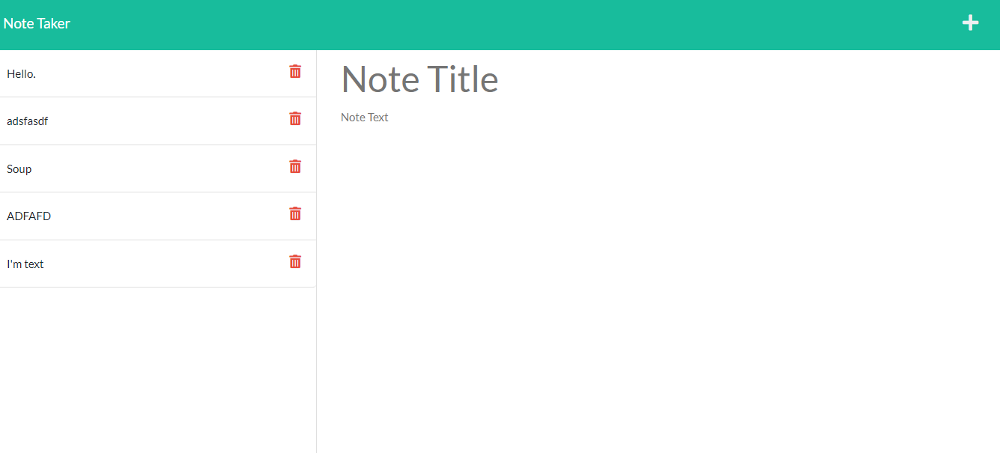

# Note-Taker

## Table of Contents
* [Description](#description)
* [Installation](#installation)
* [Usage](#usage)
* [Questions](#questions)
* [Link](#link)
        
        
## Description: 
* This allows you to be able to take notes, save them to your database, and delete them as necessary. You can name your notes as desired and store the contents therein to your heart's content.
        
        
* Contribution guidelines: If you wish to contribute to this project, please email me about the matter beforehand!

## Installation:

* Installation instructions: You can install the project yourself if so desired by using the SSH key on the gitHub website. There is also a deployed website at which you may make use of this project.
        
## Usage

* Usage information: You can use this project to take notes of what daily tasks you may have during the day.

        
## Tests:
* Test instructions: Please install the program first, open it in your terminal, and run node server.js in the terminal. It should provide you a link to a website! Click on it, and test if it's fully functional.
        
## Questions: 
        
* If you would like to contact me to address any further questions, please email me at youngleuchovius@gmail.com
* You can find my GitHub at github.com/ElyLeslie

## Link:

https://stormy-anchorage-56673.herokuapp.com/